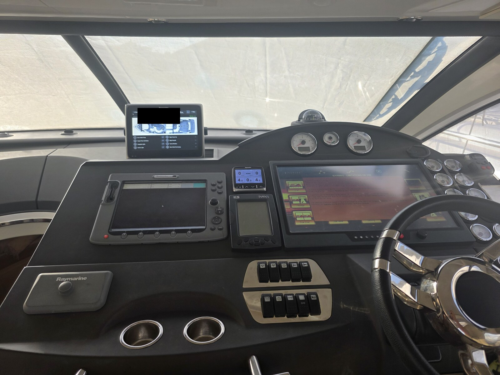
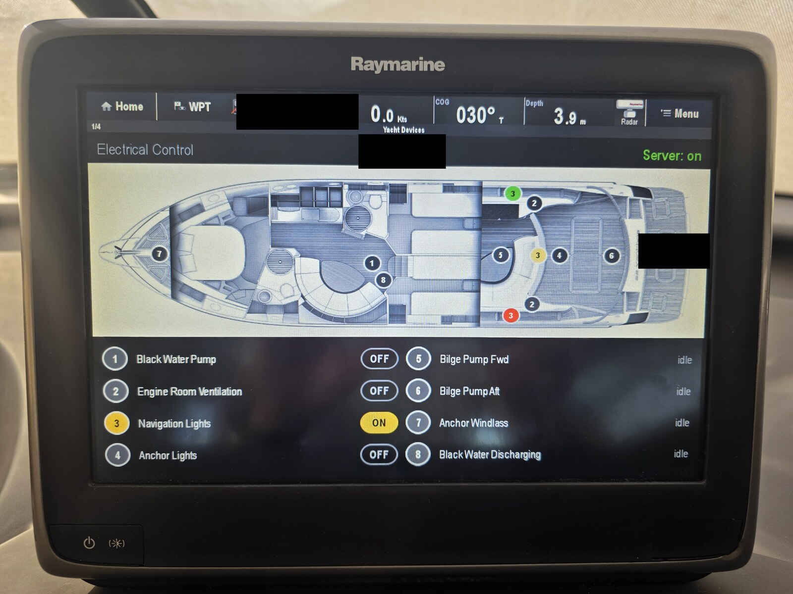
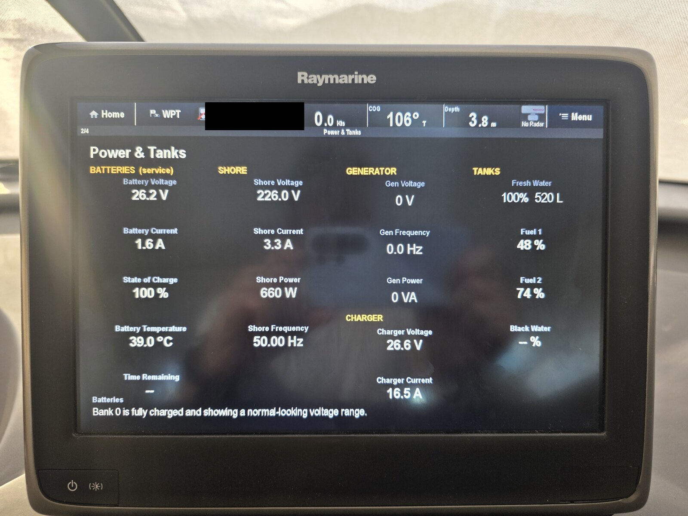
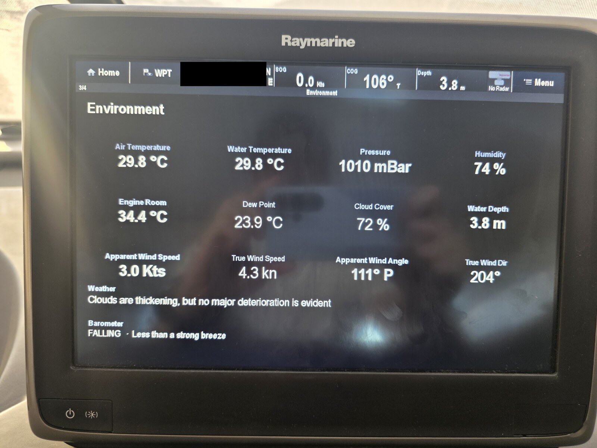
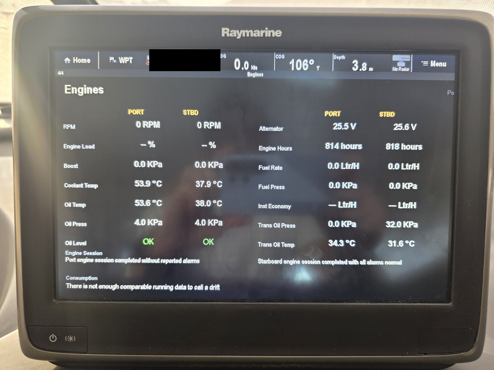

# Custom digital-switching & data pages on a Raymarine a-Series MFD (LightHouse II)

**Turning a Raymarine a-Series chartplotter into a full boat-control and data dashboard —
including LLM-written weather/engine reports — using YachtDevices digital switching,
Signal K, and a small HTTP bridge.**

This is the full story of how four custom pages were built for a twin-diesel motor
yacht: a boat-plan **electrical control** page, and three data pages (**Power & Tanks**,
**Environment**, **Engines**). It documents not just the final technique but the
**dead ends** — most importantly why the "obvious" CZone route doesn't work on
a-Series, and how an HTTP bridge solved both control and arbitrary data.

Everything here uses public, documented mechanisms (Signal K REST, NMEA 2000 PGNs, the
LightHouse "RMDS" QML page format, a YachtDevices gateway). No MFD firmware is modified;
pages install through the MFD's normal **Import Configuration File** menu.

> Platform: this was built and tested on a **Raymarine a128** (a 12″ a-Series unit),
> **LightHouse II**, QML in the **QtQuick 1.1** dialect. Companion host: a small Linux box
> (a Raspberry Pi is plenty) running **Signal K** and ingesting the N2K bus.
>
> **Design resolution — per MFD model.** Author your layout at the display's native
> resolution (EmpirBus Graphic *User Manual v2.3*, Table 3.1). **The a128 is `1280 × 800`.**
> The other 12″ units — a12 (a125/a127), c12, e12, e16, gS12/16 — are 1280 × 800 too; the
> 7″/9″ units (a7, a9, c9, e7, e9, eS7/9, gS9) are 800 × 480. After the MFD chrome (a
> **50 px** menu border + a **25 px** page-title border), the usable area on a 1280 × 800
> unit is **1280 × 725**. Author the content `Item` at the full model size and scale it to
> the runtime viewport (`transform: Scale { xScale: view.width/1280; ... }`).
>
> ⚠ **On the a128, use 1280 × 800 — not 800 × 480.** Building the boat-plan page at
> 800 × 480 renders it **distorted and cropped**; 1280 × 800 is correct and fills the
> screen, exactly as the manual's Table 3.1 says. (Tested the hard way.)

**Which MFDs this works on.** The same mechanism applies to **any Raymarine MFD running
LightHouse II** — that's the **a-, c- and e-Series** — since they share the RMDS/QML
digital-switching engine. It has **not been tested on LightHouse 3** (Axiom and LH3-
updated units); the QML/RMDS approach is assumed to be similar there but is **unverified**
— treat LH3 as "probably, but try it and see."

**Contents**
- [Architecture & wiring](#architecture--wiring)
- [Hardware you need](#hardware-you-need)
- [The example boat's circuit map](#the-example-boats-circuit-map)
- [Networking: getting the MFD to reach the bridge](#networking-getting-the-mfd-to-reach-the-bridge)
- [Software & tools](#software--tools)
- [Signal K prerequisites (plugins)](#signal-k-prerequisites-plugins)
- [Part 1 — Electrical control (the boat-plan page)](#part-1--electrical-control-the-boat-plan-page)
- [Part 2 — The data pages](#part-2--the-data-pages)
- [Part 3 — Deploy & iterate](#part-3--deploy--iterate)
- [Gotchas & lessons](#gotchas--lessons)








---

## Architecture & wiring

```
   NMEA 2000 backbone
   ══════════╤═══════════════╤═══════════════╤═══════════════╤═════════
             │               │               │               │
       ┌─────┴─────┐   ┌─────┴─────┐   ┌──────┴──────┐  ┌─────┴──────┐
       │  YDCC-04   │   │  YDRI-04   │   │ YD gateway   │  │ a-Series   │
       │ 4 relay    │   │ 4 inputs   │   │ (Wi-Fi/Eth)  │  │ MFD        │
       │ OUTPUTS    │   │ (run ind.) │   │ RAW over TCP │  │ LightHouse │
       └─────┬─────┘   └────────────┘   └──────┬──────┘  └─────┬──────┘
             │ drives circuits                 │ TCP           │ HTTP
        (nav lights, pumps…)                   │ :2002         │ (LAN)
                                               │               │
                                        ┌──────┴───────────────┴──────┐
                                        │   Companion host (Linux)     │
                                        │                              │
                                        │   Signal K  ←── decodes bus  │
                                        │   http_bridge.py             │
                                        │     GET /wx      (data)      │
                                        │     GET /set /toggle /state  │
                                        └──────────────────────────────┘

  Control  : MFD page → HTTP → bridge → PGN 127502 → gateway → YDCC relays
  Feedback : YDCC/YDRI → PGN 127501/127502 → gateway → Signal K → bridge → MFD page
  Data     : bus → Signal K → bridge (/wx) → MFD page tiles
```

- The **YDCC-04** and **YDRI-04** sit on the NMEA 2000 backbone like any other device.
- The **gateway** is the *only* thing the companion host talks to on the bus — over one
  **RAW TCP** connection. The companion host does **not** touch the CAN wiring.
- The **MFD** and the **companion host** must be on the **same IP network** (see
  [Networking](#networking-getting-the-mfd-to-reach-the-bridge)).

---

## Hardware you need

| # | Part | Role |
|---|------|------|
| 1 | **YachtDevices YDCC-04** (Circuit Control) | 4 relay **outputs** — the switched circuits (nav lights, pumps, fans…). Controlled with PGN **127502**, reports state with PGN **127501**. |
| 2 | **YachtDevices YDRI-04** (Run Indicator) *(optional)* | 4 **inputs**, read-only — shows whether a circuit is running (bilge pumps, windlass…). Reports with PGN **127501**. Skip it if you only want control. |
| 3 | **A YachtDevices gateway with a Wi-Fi or Ethernet RAW-TCP server** — one of: **YDWG-02** (Wi-Fi), **YDNR-02** (Wi-Fi router), **YDEN-02** (Ethernet) | Bridges the N2K bus to TCP so the companion host can read state and inject PGN 127502. In the gateway's web config, **enable a RAW server on a TCP port (default `:2002`) and make it *bidirectional*** — see the note below. |

> **Open the gateway's RAW TCP port `:2002` as bidirectional.** In the gateway's web
> interface set the server protocol to **RAW** (not NMEA-0183) and allow **both
> directions** on that port: the bridge must be able to **read** frames from the bus
> *and* **write** PGN 127502 back to it. If the port is left read-only (or in a
> text/NMEA-0183 mode), you'll see live state but **control won't work** — the toggles do
> nothing. This is the single most common "why won't it switch?" mistake.
| 4 | **Companion host** — any small Linux box (Raspberry Pi is fine) running **Signal K** | Runs Signal K (decodes the bus) and `http_bridge.py`. |
| 5 | **Raymarine a-Series MFD**, LightHouse II | Shows the pages. |

You do **not** need a YachtDevices DataMaster-only setup, nor the CZone Configuration
Tool (dead end on a-Series — see Part 1).

---

## The example boat's circuit map

Be explicit about **what each channel is physically wired to** — the page numbers mean
nothing until you write this down. On the example boat:

| Page # | Function | Module | Channel | Type |
|:---:|---|---|:---:|---|
| 1 | Black Water Pump | **YDCC-04** | out 1 | control (relay) |
| 2 | Engine Room Ventilation | **YDCC-04** | out 2 | control (relay) |
| 3 | Navigation Lights | **YDCC-04** | out 3 | control (relay) |
| 4 | Anchor Lights | **YDCC-04** | out 4 | control (relay) |
| 5 | Bilge Pump Fwd | **YDRI-04** | in 1 | status (read-only) |
| 6 | Bilge Pump Aft | **YDRI-04** | in 2 | status (read-only) |
| 7 | Anchor Windlass | **YDRI-04** | in 3 | status (read-only) |
| 8 | Black Water Discharging | **YDRI-04** | in 4 | status (read-only) |

So on the control page, **1–4 are switches** (YDCC outputs you can toggle) and **5–8 are
indicators** (YDRI inputs that only ever show idle/active). The YDCC lives on one switch
**bank** (instance 0 here); the page emits PGN 127502 to that bank, channels 1–4.

---

## Networking: getting the MFD to reach the bridge

This is the step most people trip on. The MFD serves/consumes data on its **Ethernet
(RayNet/SeaTalkhs) network**; your companion host has to be reachable **on that same IP
subnet** so the QML's `XMLHttpRequest` can hit it.

**Raymarine's network is `10.0.0.0/8` with fixed IPs.** All Raymarine gear on the
SeaTalkhs/RayNet backbone self-assigns **static** addresses in the **10.0.0.0/8** range
(no DHCP server hands them out — each unit picks and keeps a fixed 10.x address). So:

1. **Put the companion host on the MFD's network.** Wire it to the MFD's Ethernet
   (a **RayNet-to-RJ45** adapter cable), or bridge it in through the same switch the MFD
   uses. If your gateway is the **Wi-Fi** model, the host can instead join the gateway's
   Wi-Fi — but the *MFD* still has to route to the host, so an Ethernet link on the MFD's
   own network is the reliable path.
2. **Give the host a *static* IP inside `10.0.0.0/8`** with mask `255.0.0.0`, picking an
   address that doesn't clash with the Raymarine units already there (note theirs first).
3. **Point the pages at `http://<host-ip>:8888`** — the single value you set in the QML
   poll URLs (and the gateway address in `http_bridge.py`).
4. Verify from a laptop on the same network: `curl http://<host-ip>:8888/wx` should
   return JSON before you ever touch the MFD.

> The example files use placeholder IPs (`<host-ip>` / `192.168.0.x`). Use your own.

---

## Software & tools

- **[CAN Log Viewer](https://www.yachtd.com/products/can_view.html)** — YachtDevices'
  free NMEA 2000 viewer (Windows/macOS/Linux). Used to talk to the bus through the
  gateway and send the `YD:` configuration commands to the modules (Part 1).
- **[EmpirBus](https://www.empirbus.com/)** configuration software — used to author a
  digital-switching page and, as a side effect, to **read the DataItem catalog IDs** out
  of the QML it produces (Part 2). Current tool is **EmpirBus LogiX** (older **EmpirBus
  Studio** is EOL since 2023); free but needs an EmpirBus account. The DataItem name→ID
  map isn't published anywhere else.
- **[Signal K server](https://signalk.org/)** on the companion host (open source),
  already ingesting the N2K bus — this is what `http_bridge.py` reads.
- **YachtDevices DataMaster / RMDS package** — the base `.zip` of QML "cells" you start
  from and drop your pages into. (The cell library belongs to YachtDevices and is *not*
  redistributed here; start from your own package — see `pages/NOTE.md`.)

---

## Signal K prerequisites (plugins)

The native DataItem tiles just need Signal K decoding the bus. The **`/wx` tiles** need a
few Signal K plugins/derivations enabled — without them those tiles are simply empty:

| Value on the page | Requires |
|---|---|
| True wind (speed/dir) | **`signalk-derived-data`** with the *ground wind* (`windGround`) derivation on — produces `environment.wind.speedOverGround` / `directionTrue` |
| Dew point | **`signalk-derived-data`** dew-point calc → `environment.outside.dewPointTemperature` |
| Cloud cover / visibility | a weather source publishing `environment.weather.*` (e.g. an OpenWeather bridge/plugin) |
| Barometric tendency | **`signalk-barometer-trend`** → `environment.outside.pressure.trend.*` |
| LLM report headlines | an **LLM-analyzer plugin** writing `reports.jsonl` (see Part 2) |

None of these are required for the *control* page — that only needs Signal K decoding
PGN 127501 (`electrical.switches.bank.*`).

---

## Background: how LightHouse II "digital switching" is built

On a-Series/LightHouse II, digital-switching pages are QML, drawn from a "cell" library
that ships inside a **RMDS package** (a `.zip` of a QML tree — the format YachtDevices'
DataMaster tools produce). Two kinds of cell:

- **Control cells** — toggle / momentary / dimmer, meant to drive a switching channel.
- **DataItem cells** — a numeric/gauge bound to a fixed **DataItem ID** from the
  EmpirBus/CZone catalog (RPM = 73, coolant temp = 79, fresh-water level = 3, battery
  voltage = 107…).

The whole page is plain QML, and — crucially — QtQuick 1.1 ships **`XMLHttpRequest`**.
That one fact is what makes everything below possible.

---

## Part 1 — Electrical control (the boat-plan page)

### What we wanted

A single page: a **deck plan of the boat** with a colored dot at each consumer, each dot
an on/off control **and** a live state indicator, plus a labelled channel list.

### Attempt 1: native CZone — and why it fails on a-Series

The instinct is to use **CZone** digital switching, which LightHouse supports natively on
the larger systems. On **a-Series it does not run** — the native CZone switching UI
reports **"Not Available"**. The a-Series line only exposes digital switching through the
**YachtDevices DataMaster / RMDS** path, not the CZone display engine. So binding
controls to CZone circuits was a dead end; the page renders but the control layer never
comes alive.

We went the whole way down this path first: a **CZone configuration file (`.zcf`)**
defines the circuits (names, IDs, which YDCC/YDRI channel each drives), is **tied to each
module's serial number**, and is edited with the **CZone Configuration Tool (Windows)**;
QML control cells then bind to a circuit via `controlId` / `m_DBIdentifier`. All of that
is irrelevant on a-Series — the circuits never light up — so **the `.zcf` is not part of
the working solution and you don't need one.** The HTTP approach below drives the relay
directly and ignores CZone entirely.

Take-away: **on a-Series, plan for the YachtDevices RMDS path, not CZone.**

### One-time module configuration (CAN Log Viewer)

Before anything, give the modules a **one-time setup over the gateway with CAN Log
Viewer** (point it at the gateway's RAW TCP port), using the device `YD:` command set —
once, at the dock, with a laptop. **Read first, change only what's needed:**

- `YD:CZONE`, `YD:BANK`, `YD:DIPSWITCH` (no argument) — read the current CZone mode,
  switch-bank number and dipswitch. Ensure the **YDCC, the YDRI and the MFD are on three
  different dipswitches** and the relay sits on a known bank (the page emits PGN 127502
  to *that* bank). Often the output module is already on sane defaults — so this is
  mostly *confirming*.
- If you have the **YDRI** shipping run-indicators, **disable its battery-status
  emulation** per channel (`YD:DAT A OFF` … `D OFF`) — otherwise it injects phantom
  battery data (a fake ~2 V "bank") onto the bus and trips false alarms.

Each command answers `… DONE`. Half a dozen commands, once.

### Building the plan page

The plan is one background image (a top-down deck render — from the boat's brochure/
manual) scaled into the logical canvas. Markers are a `ListModel` of `{ n, fx, fy,
onColor }`; `fx/fy` are fractional positions over the image, so the dots land on the
right cabins regardless of scaling:

```qml
Image { id: plan; source: "plan.jpg"; x: 0; y: 0; width: content.width }

ListModel {
    id: markers
    ListElement { n: "3"; fx: 0.62; fy: 0.15; onColor: "#22cc44" }  // nav light (green)
    ListElement { n: "3"; fx: 0.63; fy: 0.87; onColor: "#ff3b30" }  // nav light (red)
    ListElement { n: "4"; fx: 0.70; fy: 0.51; onColor: "#fff2a0" }  // anchor (white-ish)
    // ...
}

Repeater {
    model: markers
    delegate: Rectangle {
        width: 34; height: 34; radius: 17
        x: plan.x + fx * plan.width - 17
        y: plan.y + fy * plan.height - 17
        color: channelOn(n) ? onColor : "#3a3a3a"    // live state → color
        Text { anchors.centerIn: parent; text: n; color: "white" }
        MouseArea { anchors.fill: parent; onClicked: toggle(n) }
    }
}
```

(A design note that cost time: on a light plan image, plain white markers vanish. The
masthead/anchor whites became a **very pale yellow** `#fff2a0` to read against the deck.)

### Driving the outputs

`toggle(n)` / the channel buttons call the bridge, which emits **PGN 127502 (Switch Bank
Control)** to the YDCC bank via the gateway. The relay reports actual state with
**PGN 127501 (Binary Status Report)**, on change.

### The hard part: state synchronization

This is where most of the real work went.

**Problem 1 — the relay latches and only reports on change.** If the page assumes its
last command "stuck", it drifts out of sync (someone flips a physical switch, a command
is lost, the module reboots). Fix: treat **PGN 127501 as the single source of truth**.
The bridge keeps **one persistent TCP connection** to the gateway (these gateways have a
*very low* connection limit — open sockets carelessly, or port-scan it, and you starve
the control link), and the page reconciles its indicators to reported state.

**Problem 2 — flicker.** Tapping a control and waiting a full poll cycle makes the button
blink off-then-on. Fix: a short **debounce + optimistic hold** — the indicator holds the
commanded state ~1.5 s, then follows real state.

**Problem 3 — "the nav lights turned on by themselves."** The scariest one. An early
version treated **any** switch-ON it saw on the bus as a "manual override" and latched it
— so a stray/delayed command (or leftover test traffic) could turn nav lights on at the
dock and keep re-asserting them. The fix is a **panel rule**, and it's worth stating as
code because it's the crux of safe auto-control:

```
for each channel:
    cmd[ch] = ON  if the MFD panel set it ON   (sticky, from a small state file)
              else auto[ch]                     (your rules: night+underway, etc.)
```

- The bridge writes a small **sticky panel-state file** whenever the MFD panel sets a
  channel (`/set`, `/toggle`).
- An **auto-controller** computes `auto[ch]` from boat state (example: nav lights ON only
  when *actually underway at night, away from the berth*; forced OFF otherwise).
- Final command = **panel-ON ? ON : auto**. Panel-ON wins; panel-OFF releases the channel
  back to auto; a spurious ON the panel never set is forced back off within one cycle.

On the example boat the auto-controller ran as a Signal K **Node-RED** flow emitting PGN
127502 every 30 s; you can equally run it as a loop next to the bridge. The important
part is the **rule**, not where it lives. `http_bridge.py` in this repo implements the
sticky panel file and a `compute_auto()` stub for you to fill in.

The `Server: on/off` indicator top-right just reports whether the page can reach the
bridge.

#### The page side (how the plan stays in sync)

On the MFD, the control page (`pages/ElectricalControl.qml`) does the mirror of the
server's job — it **polls `/state` about once a second** and colors each marker from the
returned array, with a short **optimistic hold** so a tap shows the new state
immediately instead of blinking:

```qml
function channelOn(n) {                 // displayed state
    var i = n - 1;
    if (hold[i] !== -1 && now() < until[i]) return hold[i] === 1;   // optimistic hold
    return real[i] === 1;                                           // else real state
}
function toggle(n) {                     // tap a dot / pill
    var want = channelOn(n) ? 0 : 1;
    hold[n-1] = want; until[n-1] = now() + 1500;   // hold ~1.5 s
    httpGet(bridge + "/toggle/" + n);              // ask the server to switch
}
// Timer @1 Hz -> GET /state -> real = resp.ch; drop any hold the real state caught up to
```

So the loop is: **server owns the truth (PGN 127501); the page polls it, shows an
optimistic hold on tap, and never assumes its command stuck.** See the file for the full
version (markers, channel list, `Server:` indicator).

---

## Part 2 — The data pages

Once the bridge existed for control, the same trick delivered *data* the native
DataItems can't.

### Software & workflow

1. Start from an RMDS package (YachtDevices cell library + a page QML).
2. **Hand-edit the page QML** — add/remove/position DataItem cells and custom `Text`
   tiles.

   **Getting the DataItem IDs is the catch.** The name→ID catalog is **not publicly
   documented** — it lives inside the dealer software. In practice you build a page in the
   **EmpirBus** tool, drop in the named DataItems you want, and **read the assigned IDs
   out of the QML it produces** — every cell carries an `m_Name` ↔ `m_DataItemID` pair.
   Extract that map once and reuse it. (It's full of surprises: `86 = Fuel Pressure`, and
   there are *two* economy items — `84 = Inst. Fuel Economy` and `104 = Fuel Economy`.)
   Without the EmpirBus tool (or a page someone already built with it), you're guessing
   IDs — don't.
3. **Zip** the tree into `RMDS_<name>.zip`.
4. **Import** on the MFD (Part 3).

Native cell (catalog value, unchanged):

```qml
DigitalValueDataItemCenterAligned {
    x: 30; y: 140
    m_Name: "Air Temperature"; m_CellWidth: 290; m_ValueFontSize: 46
    m_DataItemID: 58; m_PrimaryDataItemInstance: 0
}
```

### Calculated / unavailable data over HTTP (`/wx`)

The bridge's `GET /wx` reads Signal K and returns a flat JSON blob. Reading a path is one
GET (`sk()` in `http_bridge.py`). `/wx` then serves everything the catalog can't:

| Tile on the MFD | Where it comes from |
|---|---|
| **True wind** speed & direction | Signal K derived (`environment.wind.speedOverGround` / `directionTrue`) — not on the bus as a PGN here |
| **Dew point** | Signal K derived (Magnus from temp+humidity) |
| **Cloud cover** | a weather plugin (`environment.weather.cloudCover`) |
| **Barometric tendency** | a barometer-trend plugin (`…pressure.trend.tendency`, Beaufort text) |
| **Fresh-water %/litres** | raw tank level, **rescaled + capacity-corrected** in the bridge (below) |
| **Oil level OK/LOW** | a *binary* lube path shown as a colored OK/LOW instead of a fake % |
| **Fuel pressure** | `propulsion.*.fuel.pressure` (served until a native DataItem was confirmed) |

Each is a custom `Text` tile bound to a `page.*` property, refreshed by an
`XMLHttpRequest` poll (unit conversions in the QML: m/s→kn ×1.94384, rad→° ×57.2958,
K→°C −273.15, 0..1→% ×100). See `pages/Environment.qml` for a full sample page.

#### Correcting a broken sensor in the bridge

A worked example. A resistive fresh-water sender was damaged: its float sticks so the
tank reads **"empty" at 17.4%** instead of 0, and the boat's real capacity differs from
the brochure. Rather than show a lie, the bridge rescales:

```python
raw  = sk("tanks/freshWater/0/currentLevel")               # 0..1 from the bus
frac = max(0.0, min(1.0, (raw - 0.174) / (1.0 - 0.174)))   # 17.4% → 0
pct, litres = round(frac * 100), round(frac * CAPACITY_L)
```

…and the tile shows `"100%  520 L"`. (Fix the sender eventually — but keep the gauge
honest until you do.)

### LLM report headlines on the MFD

The most unusual tiles: **plain-language summaries written by an LLM.** This needs an
**LLM-analyzer Signal K plugin** — e.g. an OpenRouter-type companion plugin — that runs
periodic analyzers over the boat's own data (a weather forecast, a per-engine session
summary when an engine stops, a daily battery-health note) and writes each to a
**`reports.jsonl`** file, one JSON object per line:

```json
{"analyzer": "forecast", "report": "Clouds are thickening, but no major deterioration…\n\n<full text>"}
```

The plugin needs an **LLM API key** and costs a fraction of a cent per call. The bridge
just takes the **first line** (the ≤80-char headline) of the latest report per analyzer
(`report_headline()` in `http_bridge.py`) and the page shows it as a text line:

- **Environment**: a *Weather* headline + a *Barometer* tendency line.
- **Engines**: per-engine *session* summaries + a *consumption/drift* line.
- **Power & Tanks**: a *battery health* note.

If you don't run such a plugin, drop these tiles — the rest works without them.

---

## Part 3 — Deploy & iterate

Pages ship as a standard **RMDS `.zip`**; installing needs no special access to the MFD:

1. Copy `RMDS_<name>.zip` to the MFD's **SD card**.
2. On the MFD: **digital switching → Import Configuration File → pick the zip.**

Iterate by rebuilding the zip and re-importing.

---

## Gotchas & lessons

- **CZone is a dead end on a-Series** — use the YachtDevices RMDS path.
- **Gateway RAW port must be bidirectional.** Set its TCP server to **RAW** and **read +
  write** on the port (default `:2002`). A read-only or NMEA-0183 port lets you *see*
  state but the toggles do nothing — the #1 "why won't it switch?" trap.
- **Use the right design resolution for your model** (EmpirBus manual Table 3.1): the 12″
  units (incl. a128) are **1280×800**, usable **1280×725** after the 50 px menu + 25 px
  title borders; the 7″/9″ units are **800×480**. Author the content `Item` at the full
  size and scale it to the viewport, or fonts/positions come out wrong.
- **Cache-bust every HTTP URL** (`?t=<epoch>`).
- **Gateway connection limit is tiny** — one persistent connection, never scan it.
- **State comes from PGN 127501, not from hope.** Reconcile the UI to reported state, and
  use the panel rule so nothing auto-asserts itself.
- **QML insertion trap:** if a page keeps its `Timer` / `Component.onCompleted` *outside*
  the content `Item`, don't blindly append tiles "before the last brace" — you can land
  *inside* an `onCompleted { … }` and the **entire config silently fails to load** (the
  MFD shows **0 digital-switching pages**, not a broken single page). Insert before the
  real content-`Item` close and verify nothing landed in a handler body.
- **Two "Fuel Economy" DataItems exist** (Inst. vs plain) — check the catalog, don't guess.

---

## Repository layout

```
http_bridge.py            # companion HTTP service: /wx (data) + /set /toggle /state (control)
pages/
  ElectricalControl.qml   # sample control page: boat plan + markers + state sync
  Environment.qml         # sample data page (native cells + HTTP tiles + poll)
  NOTE.md                 # where the cell library comes from
figures/                  # the screenshots above
LICENSE
```

## License / disclaimer

Technique and example code under the MIT License (see `LICENSE`). "Raymarine",
"LightHouse", "YachtDevices", "EmpirBus", "CZone", "Signal K" are trademarks of their
respective owners; this project is not affiliated with or endorsed by any of them.
Nothing here modifies MFD firmware. Keep a known-good configuration and test at the dock.
